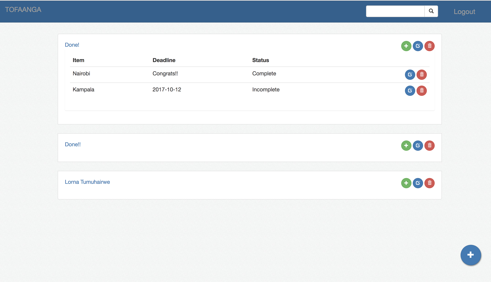

# TOFAANGA
[](https://travis-ci.org/lornatumuhairwe/tofaanga-react)
[](https://coveralls.io/github/lornatumuhairwe/tofaanga-react?branch=dev1)
## Description
This repository is home to a react front end that consumes a flask API. It implements an application to enable users to 
manage and track their bucketlists. 
The repo of the API backend can be found [here](https://github.com/lornatumuhairwe/tofaangaAPI)

The name of this application is based on a Luganda word TOFAANGA' that means DON'T DIE BEFORE ... 
Users track their goals by allowing with the following features:
- Create and view bucketlists.
- Add and view items in the different bucketlists.
- Update bucketlists and items. 
- Delete the bucketlists and its items.



### Development
The building blocks for this project are:
- [React](https://reactjs.org/) for the frontend.
- [Python (Flask)](http://flask.pocoo.org/) was used for the backend

## Installation
1. Ensure you have [NodeJS](https://nodejs.org/en/docs/) installed on your local machine
2. Clone the repository using:

 ```git clone https://github.com/lornatumuhairwe/tofaanga-react.git```
 
3. Change directory to the project folder

```cd tofaanga-react```

3. Install the project dependencies

```npm install```
4. Run application

```npm start```

5. Build the application

```npm run build```
